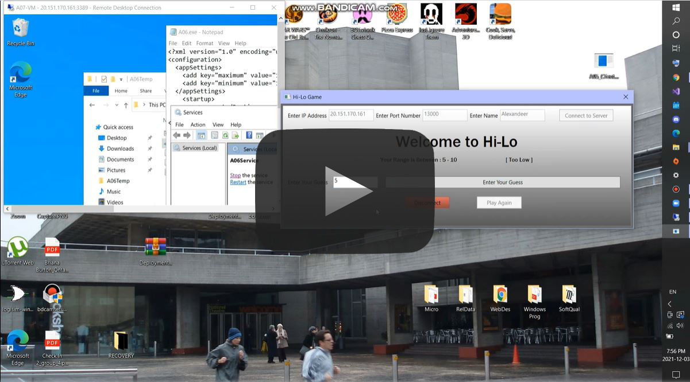
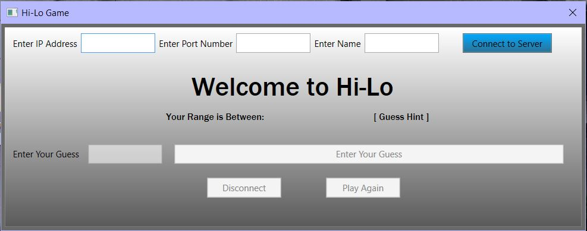
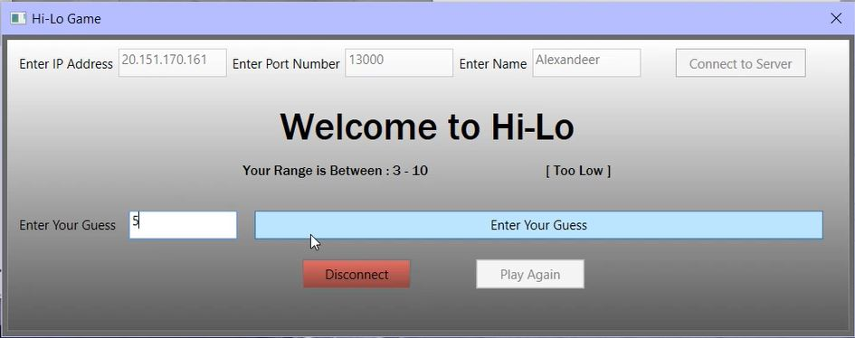
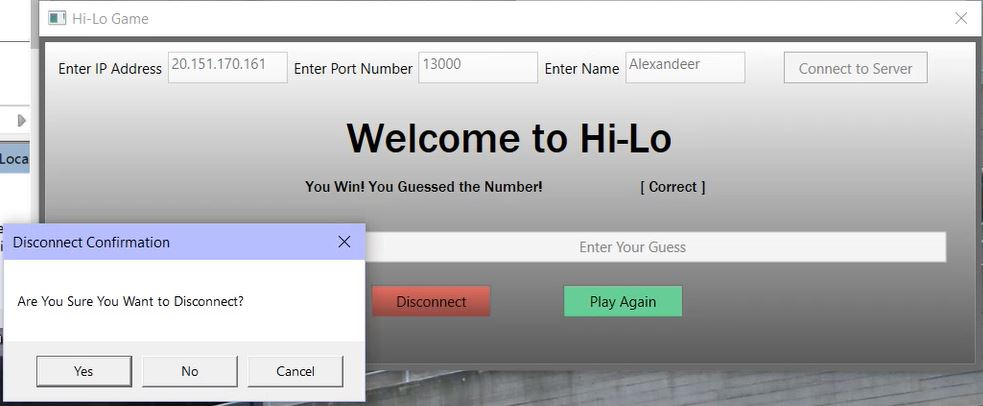

<!-- PROJECT LOGO -->
 

<h3 align="center">Windows Service TCP/IP HiLo Guessing Game</h3>

  

    Guessing Game built in C# and WPF, using a Windows Service and Azure VM.
     
     
     
  

<!-- TABLE OF CONTENTS -->

  
Table of Contents

  <ol>
    <li>
      <a href="#about-the-project">About The Project</a>
      <ul>
        <li><a href="#built-with">Built With</a></li>
      </ul>
    </li>
    <li>
      <a href="#getting-started">Getting Started</a>
    </li>
    <li><a href="#usage">Usage</a></li>
    <li><a href="#contact">Contact</a></li>
    <li><a href="#acknowledgments">Acknowledgments</a></li>
  </ol>

<!-- ABOUT THE PROJECT -->
## About The Project

<a href="https://vimeo.com/745891124"> </a>

This project is a guessing game application that the user can run on their windows PC. Once the server is successfully installed, the client will be able to connect to the server by inputing their name, port number, and IP address of the server. The user will then have their client connected to the server, and can begin playing the game. The game has a random number generated from 1-10, and the user must guess the right number. Once the user guessing the right number, they win, and can either disconnect from the server, or play again. If the user guesses the wrong number, the UI of the client will update with a new range, eg 1-8.

(<a href="#readme-top">back to top</a>)

### Built With

* [![Windows Presentation Foundation][WPF]][WPF-url]
* [![CSharp][C-sharp]][Csharp-url]
* [![Micro-Azure][Azure]][Azure-url]
* [![Win-serv][Service]][Service-url]

(<a href="#readme-top">back to top</a>)

<!-- GETTING STARTED -->
## Getting Started

To setup this program, you will need a windows computer with Visual Studio and WPF and C# support, and the ability to install a windows service. <a href="https://vimeo.com/745891124">You can follow the installation and demo of the program here.</a> 
 

If you want to change the port number (default is 13000), open the server project solution in visual studio and change the port number in the "server.cs" file in the "Run()" function.  
To instal server, open the CMD and run "installutil <directory>\A06.exe".  

Run the client, as many as you'd like, by opening the "A05_Client.exe" found within the Client>A05-TCPIPServer>Bin>Debug>A05_Client.exe  

Enter your name, the port number, and the IP address that the server is using (if running server on same system as client, just use 127.0.0.1"

(<a href="#readme-top">back to top</a>)

<!-- USAGE EXAMPLES -->
## Usage

Once the program is installed, the user will be able to start playing the game by entering their name, port number, and the ip address. The program will attempt to connect to the server, and once connected, the text boxes and buttons will be enabled. The user can now play.  

 

Example of the client application open. Here you can see the name box, port number box, and ip address box that the user must enter details into before hitting the "Connect to Server" button.

 

Example of user connected to game and playing the game. They have already made some guesses and the range has changed. They are about to enter "5" as their next guess for the game.

 

Example of user winning the game, and the prompt to the user to confirm they want to disconnect from the game after hitting the "disconnect" button.

(<a href="#readme-top">back to top</a>)

<!-- CONTACT -->
## Contact

Briana Burton - [in/briana-burton/](https://www.linkedin.com/in/briana-burton/) - brianareburton@gmail.com

Project Link: [https://github.com/bburton0334/hilo_game_windows_service](https://github.com/bburton0334/hilo_game_windows_service)

(<a href="#readme-top">back to top</a>)

<!-- ACKNOWLEDGMENTS -->
## Acknowledgments

* I am not responsible for someone maliciously copying this source code with the intent of submitting it as their own for an assignment.

(<a href="#readme-top">back to top</a>)

<!-- MARKDOWN LINKS & IMAGES -->
[WPF]: https://img.shields.io/badge/wpf-000000?style=for-the-badge&logo=xaml&logoColor=white
[WPF-url]: https://visualstudio.microsoft.com/vs/features/wpf/
[C-sharp]: https://img.shields.io/badge/C%23-000000?style=for-the-badge&logo=csharp&logoColor=white
[Csharp-url]: https://docs.microsoft.com/en-us/dotnet/csharp/
[Azure]: https://img.shields.io/badge/azure-000000?style=for-the-badge&logo=microsoftazure&logoColor=white
[Azure-url]: https://azure.microsoft.com/en-us/
[Service]: https://img.shields.io/badge/windows%20service-000000?style=for-the-badge&logo=windows&logoColor=white
[Service-url]: https://docs.microsoft.com/en-us/dotnet/framework/windows-services/introduction-to-windows-service-applications

